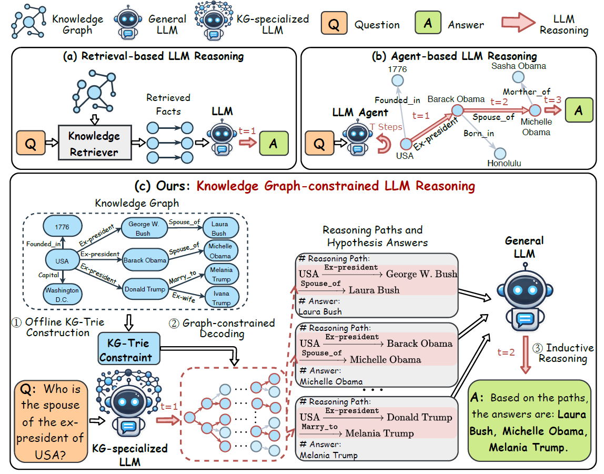

# Graph-constrained Reasoning (GCR)

Official implementation of [Graph-constrained Reasoning: Faithful Reasoning on Knowledge Graphs with Large Language Models](https://arxiv.org/abs/2410.13080) (ICML 2025).



## What This Project Does

LLMs hallucinate when answering questions grounded in knowledge graphs. GCR forces the LLM to only generate tokens corresponding to real KG paths via trie-based logit masking during decoding — zero hallucinated paths. DCA-Trie extends this with a symbolic oracle that prunes irrelevant paths before they reach the LLM, dramatically reducing search space while preserving accuracy.

## Quick Start (Colab)

The fastest way to validate results:

1. **Validation notebook**: `notebooks/05_TypeOracle_Colab_Validation.ipynb` — run the full TypeOracle pipeline in one cell.
2. **Full experiment**: `notebooks/01_GCR_Baseline.ipynb` → `02_DCA_Trie_v1.ipynb` → `03_DCA_Trie_v2.ipynb` → `04_SIR_Evaluation.ipynb` (run in order).

| Requirement | Value |
|-------------|-------|
| GPU | T4 (minimum), A100 (recommended) |
| Model | `rmanluo/GCR-Meta-Llama-3.1-8B-Instruct` |
| HF Token | Required — [accept license](https://huggingface.co/rmanluo/GCR-Meta-Llama-3.1-8B-Instruct), then set `HF_TOKEN` |

## Repository Structure

```
graph-constrained-reasoning/
├── notebooks/          # Main experiment notebooks (01–05)
├── approach1_cosine/   # Cosine similarity oracle (historical)
├── approach2_decomposed/ # Decomposed product oracle (historical)
├── approach3_symbolic/ # Symbolic TypeOracle — recommended
├── src/                # Core library (trie, oracle, decoding)
├── scripts/            # Shell scripts for training/inference
├── workflow/           # Pipeline scripts
├── docs/               # This file and documentation
├── resources/          # Figures
├── results/            # Generated predictions
└── pyproject.toml      # Poetry config
```

## Dependencies

```bash
# Install Poetry (one-time)
curl -sSL https://install.python-poetry.org | python3 -

# Create environment and install
conda create -n gcr python=3.12
conda activate gcr
poetry install
```

Key pinned versions: `transformers==4.44.2`, `accelerate`, `bitsandbytes`, `marisa-trie`.

Optional (A100 only — faster decoding):

```bash
pip install flash-attn --no-build-isolation
```

On T4 or other GPUs, `sdpa` attention works out of the box (no flash-attn needed).

## Running Locally

```bash
git clone https://github.com/rmanluo/graph-constrained-reasoning.git
cd graph-constrained-reasoning
export HF_TOKEN="hf_your_token_here"
jupyter notebook notebooks/01_GCR_Baseline.ipynb
```

Or convert notebooks to scripts for headless execution:

```bash
jupyter nbconvert --to script notebooks/01_GCR_Baseline.ipynb --output gcr_baseline
python gcr_baseline.py
```

## Configuration

All settings live in each notebook's Configuration cell (cell 2).

| Parameter | Default | Notes |
|-----------|---------|-------|
| `MODEL_PATH` | `rmanluo/GCR-Meta-Llama-3.1-8B-Instruct` | GCR checkpoint |
| `DATASET` | `RoG-webqsp` | or `RoG-cwq` |
| `SPLIT` | `test` | Evaluation split |
| `INDEX_LEN` | `2` (WebQSP) | `4` for CWQ (4-hop questions) |
| `K` | `5` | Beam size |
| `GEN_MODE` | `group-beam` | Beam search mode |
| `MAX_NEW_TOKENS` | `256` | `512` for CWQ |
| `MAX_SAMPLES` | `100` | Set `None` for full dataset |
| `QUANT` | `False` | Set `True` for T4 (8-bit) |
| `ATTN_IMPL` | `flash_attention_2` | Use `sdpa` on non-A100 GPUs |

Quick dev run (10 min, any GPU):

```python
MAX_SAMPLES = 10
K = 2
FORCE = True
```

Full experiment: `MAX_SAMPLES = None`, `K = 5`. Expect 1–2 hours (WebQSP) or 3–4 hours (CWQ) on A100.

## ORT Improvements

For experimental ORT (Ontology-Guided Reverse Thinking) improvements to DCA-Trie, see [ORT_IMPROVEMENTS.md](ORT_IMPROVEMENTS.md).

## Three Approaches

| Directory | Method | Key Idea | Encoder? | Threshold? |
|-----------|--------|----------|----------|------------|
| `approach1_cosine/` | Cosine similarity | `cos(E(path), E(question)) ≥ τ` | Yes | Yes |
| `approach2_decomposed/` | Decomposed product | `ρ_r · ρ_e · ρ_traj` | Yes | Yes |
| `approach3_symbolic/` | **Symbolic TypeOracle** | Type gate + range gate | No | No |

**Use `approach3_symbolic/` for new work.** Approaches 1–2 are historical reference points. Each folder contains its own notebooks and standalone demos.

## Troubleshooting

| Problem | Cause | Fix |
|---------|-------|-----|
| `CUDA out of memory` | Insufficient VRAM | Set `QUANT = True` in config |
| `flash-attn` install fails | No A100 available | Set `ATTN_IMPL = "sdpa"` |
| Model won't load | Missing HF token | `export HF_TOKEN="hf_..."` or set in notebook |
| `ModuleNotFoundError: src` | Wrong working directory | Run from repo root |
| `load_in_8bit` error | Wrong transformers version | Pin `transformers==4.44.2` |

## Citation

```bibtex
@inproceedings{luo2024graph,
  title={Graph-constrained Reasoning: Faithful Reasoning on Knowledge Graphs with Large Language Models},
  author={Luo, Linhao and Zhao, Zicheng and Gong, Chen and Haffari, Gholamreza and Pan, Shirui},
  booktitle={Forty-second International Conference on Machine Learning},
  year={2025}
}
```
